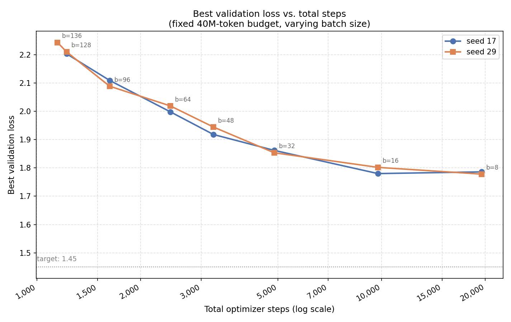

# How many gradient steps does a tiny language model actually need?

## How this started

I had an overnight training run going on my Windows laptop — batch size 48 — and
came back the next morning to find Windows had rebooted the machine for its
monthly update, killing the run partway through. Annoying, but I had
checkpoints, so I picked up training again, this time on a Linux box, and
switched to batch size 128 along the way for the extra GPU throughput.

That resumed run finished with a validation loss comfortably under 2.0. Good
result — so I tried to reproduce it with a clean batch-128 run, same everything
else. It never got there. Neither did several more attempts. My first
hypothesis was that batch 128's warmup phase was too short in absolute step
terms (more on why that seemed plausible below) — but fixing warmup barely
moved the number. That mystery is what turned into this ablation, and by the
end, the mystery resolved into something more interesting than a warmup bug:
see the note at the end of Finding 1.

## The question

With a fixed budget of 40 million training tokens, does it matter how you split
that budget between batch size and number of optimizer steps? Naively, "40M
tokens is 40M tokens" — but a run with a small batch size takes many more
gradient steps to get through the same data than a run with a large batch size.
Does that difference matter for the model you end up with?

Text for both TinyStories and OpenWebText comes from HuggingFace; the BPE
tokenizer itself, and the tokenization pipeline that turned that text into the
token files these runs trained on, is my own implementation from earlier in
this project — not a pretrained or third-party tokenizer.

## Setup

Every run below shares the same architecture, optimizer, schedule shape, and
40,000,000-token budget. The only thing that changes is `batch_size` — which, at
a fixed context length of 256, directly determines how many total optimizer
steps the run gets:

`total_steps = 40,000,000 / (batch_size × 256)`

| Setting | Value |
|---|---|
| Model | `d_model=512, d_ff=1344, num_layers=4, num_heads=16, vocab_size=10000` |
| Dataset | TinyStories |
| Token budget | 40,000,000 |
| Context length | 256 |
| Optimizer | AdamW — `lr=0.0003` peak, `betas=(0.9, 0.95)`, `weight_decay=0.1` |
| Schedule | Cosine, 2% warmup / 96% cosine (as a fraction of that run's own total steps) |
| Eval | validation loss every 20 steps, 10 batches of 16 |
| Hardware | Kaggle GPU |

I ran the full sweep twice, with two different random seeds (17 and 29), to make
sure what I was seeing was a real effect and not just noise from one lucky or
unlucky run.

## Results

For each batch size: the best validation loss seen at any point during
training, the step (and approximate token count) at which that best point
occurred, and how much worse the *final* checkpoint was than the best one.

| Batch | Steps | Best (s17) | Best (s29) | Step@best | Tokens@best | Final (s29) | Gap |
|---:|---:|---:|---:|---:|---:|---:|---:|
| 136 | 1,148  | —     | 2.243 | 1,080  | 37.6M | 2.309 | 0.066 |
| 128 | 1,220  | 2.203 | 2.210 | 1,060  | 34.7M | 2.272 | 0.062 |
| 96  | 1,627  | 2.109 | 2.089 | 1,540  | 37.8M | 2.213 | 0.125 |
| 64  | 2,441  | 1.998 | 2.019 | 1,860  | 30.5M | 2.066 | 0.047 |
| 48  | 3,255  | 1.918 | 1.944 | 3,080  | 37.8M | 2.034 | 0.090 |
| 32  | 4,882  | 1.862 | 1.854 | 4,860  | 39.8M | 1.952 | 0.098 |
| 16  | 9,765  | 1.780 | 1.802 | 9,220  | 37.8M | 1.856 | 0.054 |
| 8   | 19,531 | 1.786 | 1.778 | 19,120 | 39.2M | 1.887 | 0.109 |

*(s17/s29 = seed 17 / seed 29. batch=160 was attempted but ran out of GPU
memory; 136 was the largest batch size I could actually fit.)*

## Finding 1: fewer steps costs you, smoothly and predictably

*The x-axis is on a log scale — each gridline is a fixed multiplicative jump
(1,000 → 2,000 → 5,000 → 10,000 → 20,000) rather than a fixed additive one.
That's the right choice here because the step counts in this sweep span a 17x
range (1,148 to 19,531): on an ordinary linear axis, the four smallest-batch
points would all bunch up in the last 20% of the plot and be hard to tell
apart. A log axis spreads them out evenly instead, since it's really measuring
"how many doublings" rather than "how many steps."*

The two seeds land within a few hundredths of a loss point of each other at
every batch size, which is reassuring — this isn't run-to-run noise, it's a
real, repeatable relationship. And the relationship itself is clean: the fewer
total optimizer steps a run gets (i.e., the larger its batch size, for a fixed
token budget), the worse its best achievable loss. There's no cliff and no
surprise jump anywhere in this range — batch 136 through batch 32 traces a
smooth, well-behaved curve.

This was not the explanation I started with. My first guess, when a batch-128
run stalled around 2.2 while a batch-48 run reached 1.92, was that warmup was
too short — batch-128's schedule only gets 24 warmup steps in absolute terms,
even though it's the same 2%-of-total-steps warmup fraction as every other run.
I tested this directly: reran batch=128 with warmup stretched to 97 steps
(4x longer), everything else unchanged. The result barely moved (2.201 vs.
2.205). Warmup length wasn't the story — total step count was.

**So what actually explained that original under-2.0 result?** Going back to
how this whole investigation started: that run wasn't a clean batch-128 run at
all. It was a *resumed* run — roughly 800 steps at batch 48 before the reboot,
then continued at batch 128 afterward. By the time it switched to batch 128, it
had already banked the benefit of hundreds of small-batch steps. It wasn't
contradicting this ablation's finding — it was quietly confirming it the whole
time. The "extra steps early on, at a smaller batch, help" story is exactly
what this whole sweep ended up demonstrating on purpose.

## Finding 2: the gains taper off, but don't fully vanish

Going from batch 32 down to batch 16 down to batch 8 keeps helping, but by
smaller and smaller amounts each time. In my first seed, batch 16 → batch 8
looked essentially flat (1.780 → 1.786, if anything a touch worse). With the
second seed, the same comparison still shows a small improvement (1.802 →
1.778). Put together, the honest read is: **diminishing returns, not a hard
wall.** Somewhere around 10,000-20,000 steps, this particular model and dataset
are close to having extracted what they're going to extract — additional steps
still help a little, but you're well past the steep part of the curve.

## A quick primer: reading train loss vs. validation loss

Before getting into Finding 3, it's worth being explicit about two different
numbers that are easy to conflate: **training loss** is computed on whatever
batch of data was just used to take a gradient step — the model has, in a
sense, already seen and adjusted itself toward that exact batch. **Validation
loss** is computed on a held-out slice of data the model never trains on. The
gap between them is the whole story of generalization: training loss tells you
how well the model fits what it's been shown, validation loss tells you how
well it's actually learning something that transfers.

Over the course of a run, a healthy loss curve tends to move through three
recognizable phases:

- **Start** — a steep, fast drop, usually in the first few dozen to ~100 steps.
  Both train and validation loss fall together here, because the model is
  mostly picking up cheap, easy structure (raw token frequencies, common short
  patterns) that doesn't require any real understanding.
- **Middle** — a longer, gradually decelerating decline. Train and validation
  loss should still be moving down together, now learning genuinely harder
  structure. This is where most of the useful training happens.
- **Tail** — as the learning rate anneals toward its floor, this is where train
  and validation loss can start to *diverge*. Training loss may keep inching
  down (the model can always fit its training batches a little better), while
  validation loss flattens, gets noisy, or starts creeping back up. That
  divergence — not the absolute value of either loss on its own — is the
  practical signature of overfitting: the model is increasingly specializing
  to quirks of the training data rather than learning anything more general.

**A few concrete things worth watching for, if you want to catch this rather
than discover it after the fact:** plot train and validation loss on the same
chart, not just validation loss alone — a validation curve that looks fine in
isolation can be hiding a widening gap to the training curve. Watch specifically
for validation loss *reversing direction* (not just flattening) while training
loss keeps falling — that reversal is a much stronger signal than a plateau,
since a plateau alone can just mean "learning has slowed," while a reversal
means the model is actively moving in a direction that hurts generalization.
And track the *minimum* validation loss seen so far against the *current* one,
not just the current one in isolation — a small, steady climb away from that
minimum is easy to miss step-to-step but obvious once you compare against the
best point.

## Finding 3: more steps also means more overfitting, if you're not careful

This is the part that surprised me most, and it's not visible in the "best
loss" numbers above at all — it only shows up when you compare each run's best
checkpoint to its *final* one, exactly the divergence described above. Every
single run here ends meaningfully worse than its own best point — anywhere
from 0.05 to 0.13 loss worse — and there's no configuration where training all
the way to the end of the schedule was the right call. Longer runs (more total
steps) don't consistently show a bigger gap than shorter ones in this data, but
the gap is present everywhere, which matters practically: **if you only ever
save the last checkpoint, you're leaving a meaningful chunk of loss on the
table, regardless of batch size.** Saving whenever validation loss improves,
and using that checkpoint rather than the final one, isn't an optimization —
for this setup, it's necessary.

## What this means for hitting my actual target (1.45)

None of the batch sizes I tried get close to 1.45 within this 40M-token budget
— the best result here (1.778, batch 8) is still well above it. That's a
separate question from the one this ablation was built to answer, but it's the
one I actually care about, so it's worth being explicit: the path from here to
1.45 is more likely to run through a larger token budget and/or a different
learning rate than through further batch-size tuning within 40M tokens. This
sweep answered "how should I spend a fixed budget," not "how do I hit a fixed
target" — those turned out to be different questions.

## Caveats

- Two seeds per configuration is better than one, but it's still not a proper
  distribution — treat small differences (a few hundredths of a loss point) as
  within noise, and only the larger, consistent trends as solid.
- "Step at best" and "tokens at best" for batch sizes 8, 16, 64, and 128 come
  from the logged evaluation curve (nearest logged step to the true minimum,
  every 20 steps), not from a field recorded in the run summary the way it was
  for 32/48/96/136 — so those four are accurate to within one eval window
  (20 steps), not exact.
- batch=160 remains untested (out of memory on available hardware); the curve
  above is not confirmed to continue smoothly past batch=136.
- All runs used the same peak learning rate (0.0003). It's possible a
  lower learning rate would extend the useful range of very small batch
  sizes further, or that the diminishing returns seen in Finding 2 are partly
  an artifact of not re-tuning LR for step count. Not tested here.

## Links

[View all related charts](https://wandb.ai/manoogim-personal/abla_batch/reports/All-abla_batch-Workspace-Charts--VmlldzoxNzkzMjI5Nw==?accessToken=8is0t0dtoqyyvuexdyjdc93krdj083tce78qg33rvbgeosmpi42nq06a0gavfhbr)

