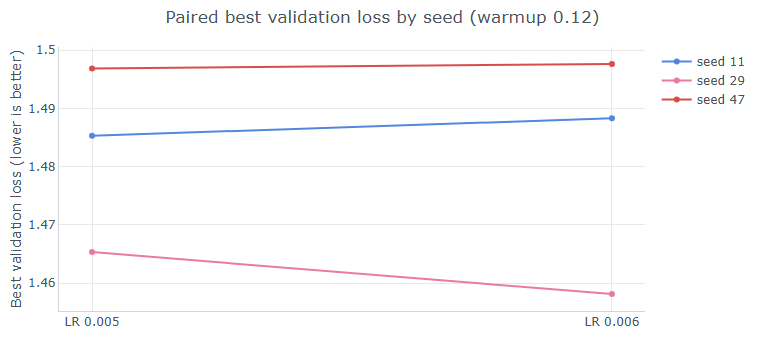

## Wandb Sweep Technique: 
* in wandb we can define a sweep via yamml config: it specifies list of parameter values, and name of our training module
* our training module accepts hyperparameters and overrides values from it's own yaml config
* then we run wandb cli command to create a sweep job, specifying the project name ( don't know why proj name is not part of yaml ) ex:

`uv run wandb sweep --project zzsweep --entity manoogim-personal tests/config/sweep/sweep_zz.yaml`

* that will output sweep id, along with the cli command to initiate the sweep
* in other words, we don't tell python to run training, we tell wandb agent to tell python to run it.
* initially i was using new project name for new sweep experiment but it is easier for comparison purposes to keep same project


## Peak Learning Rate Sweep

**Goal**: find peak lr with best validation loss, where peak_lr is the max learning rate under cosine annealing schedule

### Experiment

* peak_lr in [0.0001 0.0002 0.0003 0.0005 0.0008 0.0010 0.0013 0.0017 0.0022 0.0030 0.0040 0.0050 0.0060 0.0080] 
* default seed from yaml=29 
* cosine annealing with non-zero tail of alphamin

### Observations:

* With increasing plr, vloss was improoving
* Only 0.0050 reached vloss under 1.45
* 0.0060 was almost identical with slightly worse vloss
* 0.0080 got a bit worse
* didn't observe any numerical instability

### Next Step :

* It's a tie between 0.0050 and 0.0060, 
* need to train with more seeds, to avoid reaching conclusion based on one run

## Seed Sweep for fixed peak lr

**Goal:** since  we don't trust our conclusion that one lr is better than the other based on a single experiment b/c of randomness, let's run with different seed(s)

### Experiment

 * normally we would run just for peak lr = 0.0050, but since 0.0060 and 0.0040 was so close, we will run it for them
 * peak_lr = [0.0040, 0.0050, 0.0060], seed =[11, 47]
 * since 0.0050 already had base run with seed 29, first I ran just seed = [11, 47] , no plr override since in yaml its 0.005
 * then I realized we can vary more than one hyperparameter in  a sweep, so I ran four jobs, seed = [11, 47], plr = [0.0040, 0.0060]

### Observations

* 0.0050 and 0.0060 are still tied across three seeds results, with 0.0060 slightly better
* neither achieved best vloss under 1.45

### Next Step

* Sweep over warmup fraction in cosine annealing

## Warmup Fraction Annealing

**Goal:** vary number of warmup steps by changing warmup_frac in scheduler, number of total steps remains fixed

### Experiment

* Since default in our yaml is warmup_frac = 0.08, the sweep will be [0.4, 0.12]
* Still considering both plr values [0.0050, 0.0060], so we will have four trials, but six combinations after including two rows from the baseline

### Observation

| **Peak LR** | **Warmup**            | **Best val ↓** | **Final val ↓** |
|-------------|------------------------|----------------|------------------|
| 0.005       | **0.08 baseline**      | **1.4539**     | 1.5425           |
| 0.005       | 0.12                   | 1.4653         | **1.5301**           |
| 0.005       | 0.04                   | 1.4743         | 1.5440           |
| 0.006       | **0.08 baseline**      | **1.4563**     | 1.5425           |
| 0.006       | 0.12                   | 1.4581         | **1.5253**           |
| 0.006       | 0.04                   | 1.4864         | 1.5529           |

* warmup_frac = 0.004 doesn't improve anything
* 0.08 has the best value loss minimum for both rates, while 0.12 has the better end-of-training loss for both rates
* however baseline 0.08 had a different schedule so it is not a clean warmup-only comparison:  cosine_frac and cosine_end was different
* therefore we cannot attribute better end-of training loss just to warmup frac in case of baseline warmup frac = 0.08
* in summary, this trial doesn't help us decide between the two rates b/c results are similar and we can't decide between the two warmup fractions b/c other schedule params were not  was not controlled

| **Setting**     | **0.08 baseline** | **0.04 and 0.12 trials** |
|------------------|-------------------|--------------------------|
| minrate          | 1e-5              | 5e-4                     |
| cosine_frac      | 0.93              | 1.0                      |
| cosine_end       | 1869              | 2010                     |

### Next Steps

* to choose between 2 warmup frac, we can still first choose the rate by running with two seeds and warmup_frac = 0.12 (test is valid since those runs have same schedule)
* plr = [0.005, 0.006], warmup_frac = 0.12, seed = [11,47]
* after choosing the rate, we can keep that rate fixed and repeat trial for warmup_frac [0.08, 0.12] but this time with identical schedules of cosine frac and min rate

### Experiment: 2 seeds, 2 rates, 1 warmup frac

* seed = [11,47], plr = [0.05, 0.06], warmup_frac = 0.12
Combined with earlier run with seed 29 (which favored 0.0060): the two new seeds slightly favor 0.05, although they are practically tighed 

* Reluctantly, we choose 0.0050 for further tests



### Experiment: 1 rate, 2 warmup fractions

**Goal:** for fixed learning rate, choose warmup fraction

* Run trial plr = 0.0050, warmup_frac = 0.08 , seed = [11, 29, 47] 
* Compare with trials of same seeds, same rate for 0.12, the choose warmup_frac
* I am putting this on hold, b/c my GPU quota ran out (wait until Saturday)

| **PLR** | **Seed** | **Warmup frac** | **Best validation loss ↓** | **Run name**        | **Timestamp (UTC)**      | **Experiment**                     |
|--------|----------|------------------|-----------------------------|----------------------|----------------------------|-------------------------------------|
| 0.003  | 29       | 0.08             | 1.469652                    | plr=0.0030          | 2026-09-20 01:34:48       | Sweeping PLR                        |
| 0.004  | 29       | 0.08             | 1.457428                    | plr=0.0040          | 2026-09-20 02:44:28       | Sweeping PLR                        |
| 0.005  | 29       | 0.08             | 1.453909                    | plr=0.0050          | 2026-09-20 13:21:33       | Sweeping PLR                        |
| 0.006  | 29       | 0.08             | 1.456334                    | plr=0.0060          | 2026-09-20 14:11:07       | Sweeping PLR                        |
| 0.007  | 29       | 0.08             | 1.465045                    | plr=0.0070          | 2026-09-20 15:28:56       | Sweeping PLR                        |
| 0.008  | 29       | 0.08             | 1.478011                    | plr=0.008           | 2026-09-20 16:18:08       | Sweeping PLR                        |
| 0.006  | 29       | 0.04             | 1.486436                    | zzplr=0.006         | 2026-09-21 01:53:15       | Sweeping warmup fraction            |
| 0.006  | 29       | 0.12             | 1.458124                    | plr=0.006wf=0.12    | 2026-09-21 02:46:34       | Sweeping warmup fraction            |
| 0.005  | 29       | 0.04             | 1.474309                    | zzplr=0.005         | 2026-09-21 11:05:34       | Sweeping warmup fraction            |
| 0.005  | 29       | 0.12             | 1.465323                    | plr=0.005wf=0.12    | 2026-09-21 11:59:50       | Sweeping warmup fraction            |
| 0.005  | 11       | 0.12             | 1.485309                    | abla_batch11_136    | 2026-09-21 13:30:38       | Sweeping PLR                        |
| 0.005  | 47       | 0.12             | 1.496853                    | abla_batch47_136    | 2026-09-21 14:29:08       | Sweeping PLR                        |
| 0.006  | 11       | 0.12             | 1.488298                    | abla_batch11_136    | 2026-09-21 15:26:54       | Sweeping PLR                        |
| 0.006  | 47       | 0.12             | 1.497634                    | abla_batch47_136    | 2026-09-21 16:24:50       | Sweeping PLR                        |
| 0.005  | 29       | 0.08             | Pending                     | TBD                 | Pending                    | Clean warmup-fraction comparison    |
| 0.005  | 11       | 0.08             | Conditional                 | TBD                 | After seed 29              | Warmup confirmation                 |
| 0.005  | 47       | 0.08             | Conditional                 | TBD                 | After seed 29              | Warmup confirmation                 |


parameters:
  weight_decay:
    values: [0.03, 0.1, 0.3] no need for 0.1 b/c thats baseline
    
After training with plr=0.005 and wf=0.08, there was no improvement with validation loss. Both wf (0.08 and 0.12) and both plr (0.05 and 0.06) are approximately same.
Important measurement issue: eval batch=10 is too small.. if we consider training loss, then the winner is wf=0.12, plr=0.006

## Weight Decay 
### Experiment: fixed plr, fixed wf, sweep over wd
Next steps (to improve generalization - not merely push down validation loss): sweep over weight decay
weight_decay ∈ {0.0, 0.01, 0.03, 0.1, 0.3}
peak_lr = 0.006
warmup_frac = 0.12

*Execution plan:*
Screen with seed 29
existing baseline: 0.1
new runs: 0.0, 0.01, 0.03, 0.3
select best setting, and repeat with seeds 11 and 47
select best weight decay

After selecting weight decay, train with more steps

How to select the winner
Do not choose weight decay by training loss alone. More regularization can intentionally produce slightly worse training loss while improving validation loss.

Use:

Primary: validation loss from a larger fixed evaluation—ideally 100+ batches.
Secondary: seed-mean validation loss and worst-seed validation loss.
Diagnostic: the generalization gap between late training and validation loss.
You can retain the inexpensive 10-batch evaluations during training, then evaluate the best few saved checkpoints on 100+ batches. That avoids multiplying evaluation cost at every 20-step interval.

Decision rule
If 0.03 or 0.01 lowers both training and robust validation loss, 0.1 was over-regularizing.
If 0.3 worsens training but improves robust validation, additional regularization is helping.
If all settings produce nearly identical robust validation, weight decay is not the lever needed for <1.45; then proceed to the longer low-LR schedule.
So the revised experiment order is:

Fix LR at 0.006 and warmup at 0.12 → sweep weight decay → replicate the winner across seeds → then consider extending to ~2500 steps.
*Outcome of weight decay experiment:*
Reducing wd to under 0.1 was producing strongly worse results. Increasing to wd=0.3 produced slightly worse results, so there is no new winner, and none gets close to loss=1.45
Since we completed sweep over wd with no improvements, next step is to increase tokens budget.

## Increased Tokens Budget
Since at 70mm tokens, the robust loss is 1.48 now we will train with more tokens:
```
token_budget: 90_000_000
total_steps: approximately 2585
batch_size: 136
peak_lr: 0.0055
min_lr: 0.0005
warmup_frac: 0.12
warmup_steps: approximately 310
weight_decay: 0.1
seed: 29
```

*Decision rule:*

- If the large fixed validation evaluation is below 1.45, replicate seeds 11 and 47.
- If it reaches 1.45–1.46, try 110M tokens before reopening batch tuning.
- If it remains above 1.47, additional tokens alone may be inefficient; increase model capacity or revisit the data/evaluation pipeline.

*Execution plan*
Introduce medium token budget (code change, since tokens number is not a hiperparam)

*Outcome of increased tokens budget*
```
-m tests.nn_train --config=tests/config/abla_batch/cs336_kagle.yaml --peak_lr=0.0055 --seed=29 --token_budget=medium --warmup_frac=0.12 --weight_decay=0.1
```
This [run v1f3z7ne](https://wandb.ai/manoogim-personal/sweep-lr-kaggle/runs/v1f3z7ne) created several data points under 1.45 and min loss was 1.4290.

Metric	Value
Best validation loss	1.42905
Best step	2,520
Tokens at best	87.77M
Second-best evaluation	1.42997 at 89.16M
Final validation loss	1.46144
Last-five mean	1.44560
Runtime	60.3 minutes

However: this seemingly good result is based on a noisy eval of only num_batches=10, so we need to evaluate on at least num_batches=100. For this, will write a standalone script which only evaluates.

*Next Action*
- Write script to download the best weights artifact from wandb (version 29), and use it as checkpoint for eval
- Write script to load model weights from that artifact, then call same code that computes validation loss as the training loop, but increase num_batches
- Ideally, if validation set is small, we should use num_batches=null, and evaluate entire set. But it can also be done with num_batches=100
- Keep batch_size=16 (same as with training loop) to make pairwise comparisons possible
- Although this can be done as another wandb run, it can also be ran locally on cpu, and print desired metrics
- Metrics to report: 
```
robust_eval/validation_loss
robust_eval/validation_perplexity
robust_eval/evaluated_batches
robust_eval/evaluated_sequences
robust_eval/evaluated_tokens
robust_eval/loss_ci95_low
robust_eval/loss_ci95_high
```

*Decision Rule*
We can call target confirmed if:
- Robust loss is under 1.45, 
- Upper end of of the 95% confidence interval is under or close to 1.45

Otherwise target is not confirmed.

*Outcome of robust evaluation*

Target was not confirmed, as robust validation loss was above 1.45.

```
@@@ robust_eval: {'val_loss': 1.467939338684082, 'val_ppl': 4.340282068247264, 'eval_batches': 100, 'eval_tokens': 409600, 'eval_sequences': 1600, 'batch_loss_mean': 1.467939338684082, 'batch_loss_std': 0.07319175401376606, 'batch_loss_se': 0.007319175401376605, 'duration': 97.91150219994597, 'loss_file': 'artifacts/best_ckpt-v29\\batch_losses.npy'} !!!
```
Now we are questioning if increasing the tokens budget was a step in the right direction? To answer it, we will compare with the best result under the small tokens budget

*Next Action:*
Evaluate against best result under the 70mm baseline, which was artifact version 14:
```
run:          u8lsrjvo
peak_lr:      0.006
warmup_frac:  0.12
token budget: 70M
checkpoint:   step 1740, 60.61M training tokens
```
Decision rule will be:
- if v29 is materially better than v14, then expanding the token budget was a step in the right direction.
- if they are approx equal, then the apparent improvement in v29 was due to noise, and further steps in that direction are unlikely to close the gap
- if v29 is worse, then prefer the 70mm budget, revert back to v14, and investigate schedule differences

This is the result of v14 robust evaluation - it shows worse than v29:
```
@@@ robust_eval: {'val_loss': 1.534191734790802, 'val_ppl': 4.637575623667081, 'eval_batches': 100, 'eval_tokens': 409600, 'eval_sequences': 1600, 'batch_loss_mean': 1.534191734790802, 'batch_loss_std': 0.07396694044547322, 'batch_loss_se': 0.007396694044547322, 'duration': 100.03331800014712, 'loss_file': 'artifacts/best_ckpt-v14\\batch_losses.npy'} !!!
```
Summary of v29 vs v14
Checkpoint	Training tokens at checkpoint	Robust loss	Perplexity
best_ckpt:v14	60.61M	1.53419	4.63757
best_ckpt:v29	87.77M	1.46794	4.34028

### Conclusion of increased token budget

- v29 is clearly better than v14
- robust loss now is 1.46794, so not below 1.45
- the gap is small, and increasing the budget to 115mm is a reasonable next trial

## Final Conclusion
With budget of 115mm tokens, target loss is achieved and surpassed, and confirmed with 3 seeds.

| Seed | Run      | Loss at first <1.45 | Step | Tokens  | Token budget | Elapsed to target | Final val loss | Best val loss | Total elapsed |
|------|----------|----------------------|------|---------|--------------|-------------------|----------------|----------------|----------------|
| 29   | [5kc5rp07](https://wandb.ai/manoogim-personal/sweep-lr-kaggle/runs/5kc5rp07) | 1.4489               | 2,740 | 95.43M | 83.0%        | 1:09:50           | 1.4137         | 1.4137         | 1:23:43        |
| 11   | [sfjp5kvl](  https://wandb.ai/manoogim-personal/sweep-lr-kaggle/runs/sfjp5kvl) | 1.4490               | 2,840 | 98.91M | 86.0%        | 1:20:13           | 1.4197         | 1.4189         | 1:32:46        |
| 47   | [7fmke6hw](https://wandb.ai/manoogim-personal/sweep-lr-kaggle/runs/7fmke6hw) | 1.4482               | 2,760 | 96.13M | 83.6%        | 1:17:46           | 1.4161         | 1.4161         | 1:32:32        |
| Mean | —        | 1.4487               | 2,780 | 96.82M | 84.2%        | 1:15:56           | 1.4165         | 1.4162         | 1:29:41        |

