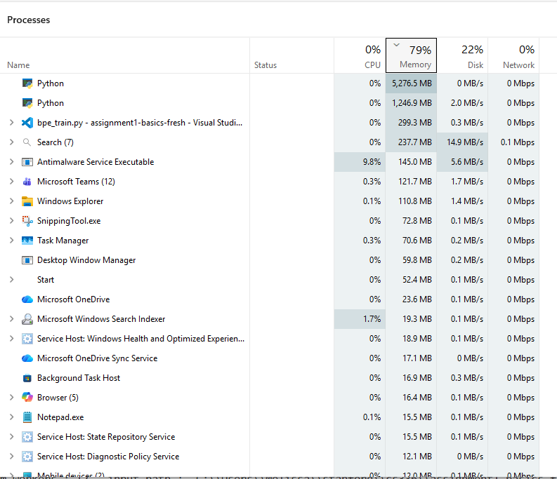

# sample_and_profile.py on owt to produce a 2GB sample

This script (written by claude) truncates owt dataset and runs pretokenization. 
It reports timing for read, decode, split and regex for each chunk
```
Source file: C:\Users\Melissa\stanford\cs336\assignment1-basics-fresh\data\owt_train.txt  (6.00 GB)
Writing 2000 MB sample to: C:\Users\Melissa\stanford\cs336\assignment1-basics-fresh\data\owt_train.txt_sample_2000mb.txt
Sample written: 2097.1 MB (trimmed to doc boundary)

Running pretokenize_parallel with 4 workers on the sample...
Running pretokenize with 4 workers ...
[worker pid=22032] bytes=524,244,630  read=0.4s  decode=2.8s  split=9.4s  regex_scan=321.5s  total=334.2s
[worker pid=23588] bytes=524,329,174  read=0.5s  decode=3.2s  split=8.4s  regex_scan=324.4s  total=336.4s
[worker pid=26148] bytes=524,280,281  read=0.5s  decode=3.2s  split=24.8s  regex_scan=313.7s  total=342.2s
[worker pid=15832] bytes=524,293,909  read=0.5s  decode=3.2s  split=15.0s  regex_scan=323.7s  total=342.3s

--- Results on sample ---
Sample size:            2097.1 MB
Wall time:               358.1 s
Peak memory (parent):    1056.0 MB  (note: excludes worker subprocess memory)
Unique pre-token entries (pre-merge across workers): 2,156,718

--- Extrapolated full-corpus estimate (linear scaling, rough) ---
Full corpus size:        6.00 GB  (2.9x sample)
Estimated pretok time:   1025 s  (~17.1 min)
Note: memory does NOT scale purely linearly -- vocabulary diversity (unique pre-token count) grows sub-linearly with corpus size for natural text, but peak RAM still needs its own check on a larger sample before trusting this number for memory.

Sample file left at: C:\Users\Melissa\stanford\cs336\assignment1-basics-fresh\data\owt_train.txt_sample_2000mb.txt (delete manually if you don't need it)
```
# bpe_train on owt sample of 2GB with 10K vocab

## Pretokenizing owt sample 2GB vs tinystories(4 workers)

* While profiling pretokenization we got worse time than while bpe training: 342 sec vs 315 sec. Most likely b/c malloc was active during profiling.
* Comparing with tinystories: note that tinystories is slightly bigger: 2.2GB vs 2.0GB and chunk sizes are bigger 557MB vs 524MB (ratio = 1.06). 
So pretokenization time can be expected to be a little worse, but we are getting more than proportionally worse: 415 vs 315 (ratio = 1.4)
* Conclusion: pretokenization speed is worse for owt than tinystories. (More workers would help!)

## Merging owt sample 2GB
Merge loop = 493 - 316 = 177 sec
```
bpe_train.py
Running pretokenize with 4 workers ...
[worker pid=19916] bytes=524,244,630  read=1.1s  decode=3.2s  split=7.6s  regex_scan=300.0s  total=311.7s
[worker pid=20720] bytes=524,280,281  read=0.9s  decode=2.9s  split=19.1s  regex_scan=290.3s  total=313.2s
[worker pid=24316] bytes=524,329,174  read=0.6s  decode=1.2s  split=7.8s  regex_scan=304.8s  total=314.5s
[worker pid=5968] bytes=524,293,909  read=0.4s  decode=0.9s  split=5.5s  regex_scan=309.1s  total=315.9s
merge 1/9743  pair=( , t)  freq=45505851  vocab_size=258  time=2026-08-12 12:55:21
merge 501/9743  pair=( e, ven)  freq=345899  vocab_size=758  time=2026-08-12 12:56:59
merge 1001/9743  pair=( cont, ro)  freq=152315  vocab_size=1258  time=2026-08-12 12:57:11
merge 1501/9743  pair=(n, ect)  freq=93773  vocab_size=1758  time=2026-08-12 12:57:19
merge 2001/9743  pair=(end, er)  freq=66748  vocab_size=2258  time=2026-08-12 12:57:26
merge 2501/9743  pair=( we, ap)  freq=50579  vocab_size=2758  time=2026-08-12 12:57:29
merge 3001/9743  pair=( certain, ly)  freq=40021  vocab_size=3258  time=2026-08-12 12:57:32
merge 3501/9743  pair=(1, 00)  freq=32568  vocab_size=3758  time=2026-08-12 12:57:37
merge 4001/9743  pair=( M, ike)  freq=26801  vocab_size=4258  time=2026-08-12 12:57:40
merge 4501/9743  pair=( interest, s)  freq=23037  vocab_size=4758  time=2026-08-12 12:57:42
merge 5001/9743  pair=(E, ven)  freq=19744  vocab_size=5258  time=2026-08-12 12:57:44
merge 5501/9743  pair=(D, P)  freq=17162  vocab_size=5758  time=2026-08-12 12:57:46
merge 6001/9743  pair=( rem, ark)  freq=15358  vocab_size=6258  time=2026-08-12 12:57:51
merge 6501/9743  pair=( w, age)  freq=13804  vocab_size=6758  time=2026-08-12 12:57:52
merge 7001/9743  pair=( we, ird)  freq=12371  vocab_size=7258  time=2026-08-12 12:57:53
merge 7501/9743  pair=( un, w)  freq=11176  vocab_size=7758  time=2026-08-12 12:57:55
merge 8001/9743  pair=( ill, ness)  freq=10097  vocab_size=8258  time=2026-08-12 12:57:56
merge 8501/9743  pair=( C, H)  freq=9232  vocab_size=8758  time=2026-08-12 12:57:56
merge 9001/9743  pair=(":, ")  freq=8437  vocab_size=9258  time=2026-08-12 12:58:01
merge 9501/9743  pair=( che, st)  freq=7839  vocab_size=9758  time=2026-08-12 12:58:02
merge 9743/9743  pair=( tal, ented)  freq=7545  vocab_size=10000  time=2026-08-12 12:58:02
BPE Training took 493.7 seconds. Vocab size=10000, merge pairs=9743
Longest word is b'----------------'
{'prefix': 'owt', 'num_workers': 4, 'input_path': 'C:\\Users\\Melissa\\stanford\\cs336\\assignment1-basics-fresh\\data\\owt_train.txt_sample_2000mb.txt', 'vocab_size': 10000, 'special_tokens': ['<|endoftext|>'], 'num_merges': 9743, 'trained_at': '2026-08-12 12:49:50', 'trained_sec': '493.7 seconds', 'longest_word': '----------------'}
Serialized config, vocab and merges to out/owt
```
# bpe_train on owt sample of 2.2GB with 10K vocab

## bpe_train on owt sample 2.2 GB, 4 workers
This sample size more closely matches tinystories, although now owt sample is bigger than tinystories. What can we say about pretokenization time?
It increased a lot from 315 on 2GB to 719 on 2.2 GB.
What can we say about training time?
Total bpe training went from 493 to 916 (merge loop is 916 - 719 = 199 sec). It is normal that merging time increased since dataset is bigger.
```
C:\Users\Melissa\stanford\cs336\assignment1-basics-fresh>c:\Users\Melissa\stanford\cs336\assignment1-basics-fresh\.venv\Scripts\python.exe c:/Users/Melissa/stanford/cs336/assignment1-basics-fresh/tests/bpe_train.py
Running pretokenize with 4 workers ...
[worker pid=27284] bytes=584,049,445  read=0.3s  decode=3.5s  split=9.9s  regex_scan=673.5s  total=687.2s
[worker pid=26052] bytes=584,059,379  read=0.3s  decode=2.9s  split=9.9s  regex_scan=675.3s  total=688.4s
[worker pid=16404] bytes=584,056,791  read=0.3s  decode=7.1s  split=28.2s  regex_scan=680.4s  total=716.0s
[worker pid=25900] bytes=584,051,267  read=0.3s  decode=3.3s  split=28.8s  regex_scan=686.7s  total=719.2s
merge 1/9743  pair=( , t)  freq=50698797  vocab_size=258  time=2026-08-12 13:54:29
merge 501/9743  pair=( e, ven)  freq=386262  vocab_size=758  time=2026-08-12 13:56:18
merge 1001/9743  pair=(or, n)  freq=169828  vocab_size=1258  time=2026-08-12 13:56:31
merge 1501/9743  pair=(ort, un)  freq=104433  vocab_size=1758  time=2026-08-12 13:56:37
merge 2001/9743  pair=( add, ress)  freq=74451  vocab_size=2258  time=2026-08-12 13:56:46
merge 2501/9743  pair=(E, N)  freq=56331  vocab_size=2758  time=2026-08-12 13:56:50
merge 3001/9743  pair=( car, ry)  freq=44467  vocab_size=3258  time=2026-08-12 13:56:53
merge 3501/9743  pair=( us, es)  freq=36281  vocab_size=3758  time=2026-08-12 13:57:00
merge 4001/9743  pair=( rest, rict)  freq=29837  vocab_size=4258  time=2026-08-12 13:57:03
merge 4501/9743  pair=( pl, aced)  freq=25645  vocab_size=4758  time=2026-08-12 13:57:05
merge 5001/9743  pair=(E, ven)  freq=22024  vocab_size=5258  time=2026-08-12 13:57:08
merge 5501/9743  pair=( v, an)  freq=19124  vocab_size=5758  time=2026-08-12 13:57:14
merge 6001/9743  pair=( A, T)  freq=17103  vocab_size=6258  time=2026-08-12 13:57:16
merge 6501/9743  pair=(az, e)  freq=15374  vocab_size=6758  time=2026-08-12 13:57:18
merge 7001/9743  pair=(M, P)  freq=13772  vocab_size=7258  time=2026-08-12 13:57:19
merge 7501/9743  pair=( implement, ation)  freq=12441  vocab_size=7758  time=2026-08-12 13:57:20
merge 8001/9743  pair=( c, os)  freq=11246  vocab_size=8258  time=2026-08-12 13:57:21
merge 8501/9743  pair=( con, sole)  freq=10284  vocab_size=8758  time=2026-08-12 13:57:26
merge 9001/9743  pair=( cl, ar)  freq=9394  vocab_size=9258  time=2026-08-12 13:57:27
merge 9501/9743  pair=( Ex, pl)  freq=8750  vocab_size=9758  time=2026-08-12 13:57:28
merge 9743/9743  pair=(2, 50)  freq=8411  vocab_size=10000  time=2026-08-12 13:57:29
BPE Training took 916.7 seconds. Vocab size=10000, merge pairs=9743
Longest word is b'----------------'
{'prefix': 'owt', 'num_workers': 4, 'input_path': 'C:\\Users\\Melissa\\stanford\\cs336\\assignment1-basics-fresh\\data\\owt_train.txt_sample_2228mb.txt', 'vocab_size': 10000, 'special_tokens': ['<|endoftext|>'], 'num_merges': 9743, 'trained_at': '2026-08-12 13:42:14', 'trained_sec': '916.7 seconds', 'longest_word': '----------------'}
Serialized config, vocab and merges to out/owt
```
## Training 2.2GB owt sample, 12 workers
Increasing number of workrs helps only if memory supports it. 
In this run I observed there was up to 5% disk activity in Task manager attributed to some of the 8 python processes.
That slows down pretokenization to 1090 in this run. (Maybe I should try decreasing number of workers to 2)
Training loop remains more-less constant around 190 for this size of owt sample.

Pretokenize = 900 sec
Total training = 1090 sec
Merge loop = 1090 - 900 = 190 sec
```
bpe_train.py
Running pretokenize with 12 workers on C:\Users\Melissa\stanford\cs336\assignment1-basics-fresh\data\owt_train.txt_sample_2228mb.txt...
[worker pid=17632] bytes=194,687,008  read=0.3s  decode=0.5s  split=2.0s  regex_scan=875.1s  total=878.0s
[worker pid=22672] bytes=194,685,327  read=0.2s  decode=0.3s  split=1.5s  regex_scan=876.1s  total=878.1s
[worker pid=11180] bytes=194,671,536  read=1.0s  decode=9.5s  split=6.2s  regex_scan=864.1s  total=880.8s
[worker pid=8096] bytes=194,687,044  read=0.4s  decode=0.7s  split=4.4s  regex_scan=883.8s  total=889.2s
[worker pid=26816] bytes=194,681,289  read=0.6s  decode=0.9s  split=6.3s  regex_scan=886.5s  total=894.3s
[worker pid=22620] bytes=194,686,284  read=0.6s  decode=1.1s  split=7.9s  regex_scan=885.4s  total=895.1s
[worker pid=3756] bytes=194,683,813  read=1.2s  decode=6.6s  split=14.4s  regex_scan=873.1s  total=895.3s
[worker pid=24592] bytes=194,695,918  read=1.2s  decode=8.0s  split=13.9s  regex_scan=875.5s  total=898.6s
[worker pid=24580] bytes=194,680,040  read=1.1s  decode=8.3s  split=13.5s  regex_scan=876.7s  total=899.6s
[worker pid=2280] bytes=194,691,114  read=1.1s  decode=8.6s  split=5.4s  regex_scan=884.5s  total=899.6s
[worker pid=22488] bytes=194,681,872  read=0.7s  decode=2.6s  split=9.7s  regex_scan=886.9s  total=899.9s
[worker pid=9136] bytes=194,685,637  read=1.0s  decode=4.9s  split=8.3s  regex_scan=886.6s  total=900.8s
merge 1/9743  pair=( , t)  freq=50698797  vocab_size=258  time=2026-08-12 14:45:49
merge 501/9743  pair=( e, ven)  freq=386262  vocab_size=758  time=2026-08-12 14:47:32
merge 1001/9743  pair=(or, n)  freq=169828  vocab_size=1258  time=2026-08-12 14:47:44
merge 1501/9743  pair=(ort, un)  freq=104433  vocab_size=1758  time=2026-08-12 14:47:49
merge 2001/9743  pair=( add, ress)  freq=74451  vocab_size=2258  time=2026-08-12 14:47:57
merge 2501/9743  pair=(E, N)  freq=56331  vocab_size=2758  time=2026-08-12 14:48:00
merge 3001/9743  pair=( car, ry)  freq=44467  vocab_size=3258  time=2026-08-12 14:48:03
merge 3501/9743  pair=( us, es)  freq=36281  vocab_size=3758  time=2026-08-12 14:48:09
merge 4001/9743  pair=( rest, rict)  freq=29837  vocab_size=4258  time=2026-08-12 14:48:12
merge 4501/9743  pair=( pl, aced)  freq=25645  vocab_size=4758  time=2026-08-12 14:48:15
merge 5001/9743  pair=(E, ven)  freq=22024  vocab_size=5258  time=2026-08-12 14:48:18
merge 5501/9743  pair=( v, an)  freq=19124  vocab_size=5758  time=2026-08-12 14:48:24
merge 6001/9743  pair=( A, T)  freq=17103  vocab_size=6258  time=2026-08-12 14:48:26
merge 6501/9743  pair=(az, e)  freq=15374  vocab_size=6758  time=2026-08-12 14:48:28
merge 7001/9743  pair=(M, P)  freq=13772  vocab_size=7258  time=2026-08-12 14:48:29
merge 7501/9743  pair=( implement, ation)  freq=12441  vocab_size=7758  time=2026-08-12 14:48:31
merge 8001/9743  pair=( c, os)  freq=11246  vocab_size=8258  time=2026-08-12 14:48:33
merge 8501/9743  pair=( con, sole)  freq=10284  vocab_size=8758  time=2026-08-12 14:48:38
merge 9001/9743  pair=( cl, ar)  freq=9394  vocab_size=9258  time=2026-08-12 14:48:39
merge 9501/9743  pair=( Ex, pl)  freq=8750  vocab_size=9758  time=2026-08-12 14:48:40
merge 9743/9743  pair=(2, 50)  freq=8411  vocab_size=10000  time=2026-08-12 14:48:40
BPE Training took 1090.7 seconds. Vocab size=10000, merge pairs=9743
Longest word is b'----------------'
{'prefix': 'owt', 'num_workers': 12, 'input_path': 'C:\\Users\\Melissa\\stanford\\cs336\\assignment1-basics-fresh\\data\\owt_train.txt_sample_2228mb.txt', 'vocab_size': 10000, 'special_tokens': ['<|endoftext|>'], 'num_merges': 9743, 'trained_at': '2026-08-12 14:30:32', 'trained_sec': '1090.7 seconds', 'longest_word': '----------------'}
Serialized config, vocab and merges to out/owt
```

## Training 2.2GB owt sample, 2 workers
pretokenize = 929 (better than 12 workers but worse than 4)
total = 1121
merging = 121 - 929 =  192
 hmm two workers are unevenly distributed 5gb vs 1 gb

```
bpe_train.py
Running pretokenize with 2 workers on C:\Users\Melissa\stanford\cs336\assignment1-basics-fresh\data\owt_train.txt_sample_2228mb.txt...
[worker pid=26004] bytes=1,168,108,058  read=1.4s  decode=4.7s  split=29.3s  regex_scan=889.5s  total=924.9s
[worker pid=20716] bytes=1,168,108,824  read=1.1s  decode=1.4s  split=9.2s  regex_scan=918.1s  total=929.8s
merge 1/9743  pair=( , t)  freq=50698797  vocab_size=258  time=2026-08-12 15:15:29
merge 501/9743  pair=( e, ven)  freq=386262  vocab_size=758  time=2026-08-12 15:17:16
merge 1001/9743  pair=(or, n)  freq=169828  vocab_size=1258  time=2026-08-12 15:17:28
merge 1501/9743  pair=(ort, un)  freq=104433  vocab_size=1758  time=2026-08-12 15:17:34
merge 2001/9743  pair=( add, ress)  freq=74451  vocab_size=2258  time=2026-08-12 15:17:42
merge 2501/9743  pair=(E, N)  freq=56331  vocab_size=2758  time=2026-08-12 15:17:45
merge 3001/9743  pair=( car, ry)  freq=44467  vocab_size=3258  time=2026-08-12 15:17:49
merge 3501/9743  pair=( us, es)  freq=36281  vocab_size=3758  time=2026-08-12 15:17:54
merge 4001/9743  pair=( rest, rict)  freq=29837  vocab_size=4258  time=2026-08-12 15:17:57
merge 4501/9743  pair=( pl, aced)  freq=25645  vocab_size=4758  time=2026-08-12 15:17:59
merge 5001/9743  pair=(E, ven)  freq=22024  vocab_size=5258  time=2026-08-12 15:18:02
merge 5501/9743  pair=( v, an)  freq=19124  vocab_size=5758  time=2026-08-12 15:18:07
merge 6001/9743  pair=( A, T)  freq=17103  vocab_size=6258  time=2026-08-12 15:18:09
merge 6501/9743  pair=(az, e)  freq=15374  vocab_size=6758  time=2026-08-12 15:18:11
merge 7001/9743  pair=(M, P)  freq=13772  vocab_size=7258  time=2026-08-12 15:18:12
merge 7501/9743  pair=( implement, ation)  freq=12441  vocab_size=7758  time=2026-08-12 15:18:13
merge 8001/9743  pair=( c, os)  freq=11246  vocab_size=8258  time=2026-08-12 15:18:15
merge 8501/9743  pair=( con, sole)  freq=10284  vocab_size=8758  time=2026-08-12 15:18:20
merge 9001/9743  pair=( cl, ar)  freq=9394  vocab_size=9258  time=2026-08-12 15:18:20
merge 9501/9743  pair=( Ex, pl)  freq=8750  vocab_size=9758  time=2026-08-12 15:18:21
merge 9743/9743  pair=(2, 50)  freq=8411  vocab_size=10000  time=2026-08-12 15:18:22
BPE Training took 1121.0 seconds. Vocab size=10000, merge pairs=9743
Longest word is b'----------------'
{'prefix': 'owt', 'num_workers': 2, 'input_path': 'C:\\Users\\Melissa\\stanford\\cs336\\assignment1-basics-fresh\\data\\owt_train.txt_sample_2228mb.txt', 'vocab_size': 10000, 'special_tokens': ['<|endoftext|>'], 'num_merges': 9743, 'trained_at': '2026-08-12 14:59:43', 'trained_sec': '1121.0 seconds', 'longest_word': '----------------'}
Serialized config, vocab and merges to out/owt
```
## Training 2.2gb dataset, 2 workers, 10000 vocab
I kept vocab size at 10,000 hoping to see that merging time increase is proportional to dataset increase
tokenize: 14613 sec aka 4 hours
total:15,251 sec
merging: 648 sec


```
bpe_train.py
Running pretokenize with 2 workers on C:\Users\Melissa\stanford\cs336\assignment1-basics-fresh\data\owt_train.txt_sample_2228mb.txt...
Chunk size: 1168108824
Chunk size: 1168108058
[worker pid=19632] bytes=1,168,108,824  read=0.9s  decode=1.7s  split=9.9s  regex_scan=14587.7s  total=14600.0s
[worker pid=22912] bytes=1,168,108,058  read=1.3s  decode=5.8s  split=37.3s  regex_scan=14568.8s  total=14613.1s
merge 1/9743  pair=( , t)  freq=50698797  vocab_size=258  time=2026-08-12 19:38:37
merge 501/9743  pair=( e, ven)  freq=386262  vocab_size=758  time=2026-08-12 19:46:53
merge 1001/9743  pair=(or, n)  freq=169828  vocab_size=1258  time=2026-08-12 19:47:21
merge 1501/9743  pair=(ort, un)  freq=104433  vocab_size=1758  time=2026-08-12 19:47:34
merge 2001/9743  pair=( add, ress)  freq=74451  vocab_size=2258  time=2026-08-12 19:47:51
merge 2501/9743  pair=(E, N)  freq=56331  vocab_size=2758  time=2026-08-12 19:47:58
merge 3001/9743  pair=( car, ry)  freq=44467  vocab_size=3258  time=2026-08-12 19:48:07
merge 3501/9743  pair=( us, es)  freq=36281  vocab_size=3758  time=2026-08-12 19:48:19
merge 4001/9743  pair=( rest, rict)  freq=29837  vocab_size=4258  time=2026-08-12 19:48:25
merge 4501/9743  pair=( pl, aced)  freq=25645  vocab_size=4758  time=2026-08-12 19:48:31
merge 5001/9743  pair=(E, ven)  freq=22024  vocab_size=5258  time=2026-08-12 19:48:36
merge 5501/9743  pair=( v, an)  freq=19124  vocab_size=5758  time=2026-08-12 19:48:44
merge 6001/9743  pair=( A, T)  freq=17103  vocab_size=6258  time=2026-08-12 19:48:46
merge 6501/9743  pair=(az, e)  freq=15374  vocab_size=6758  time=2026-08-12 19:48:47
merge 7001/9743  pair=(M, P)  freq=13772  vocab_size=7258  time=2026-08-12 19:48:48
merge 7501/9743  pair=( implement, ation)  freq=12441  vocab_size=7758  time=2026-08-12 19:48:49
merge 8001/9743  pair=( c, os)  freq=11246  vocab_size=8258  time=2026-08-12 19:48:51
merge 8501/9743  pair=( con, sole)  freq=10284  vocab_size=8758  time=2026-08-12 19:48:56
merge 9001/9743  pair=( cl, ar)  freq=9394  vocab_size=9258  time=2026-08-12 19:48:57
merge 9501/9743  pair=( Ex, pl)  freq=8750  vocab_size=9758  time=2026-08-12 19:48:57
merge 9743/9743  pair=(2, 50)  freq=8411  vocab_size=10000  time=2026-08-12 19:48:58
BPE Training took 15251.6 seconds. Vocab size=10000, merge pairs=9743
Longest word is b'----------------'
{'prefix': 'owt', 'num_workers': 2, 'input_path': 'C:\\Users\\Melissa\\stanford\\cs336\\assignment1-basics-fresh\\data\\owt_train.txt_sample_2228mb.txt', 'vocab_size': 10000, 'special_tokens': ['<|endoftext|>'], 'num_merges': 9743, 'trained_at': '2026-08-12 15:34:39', 'trained_sec': '15251.6 seconds', 'longest_word': '----------------'}
Serialized config, vocab and merges to out/owt
```

# bpe_train owt sample 2.2GB with 32k vocab, 4 workers
pretokenize= 13,173 sec
merging = 17,136 sec
total= 30,309 sec
```
bpe_train.py
Running pretokenize with 4 workers on C:\Users\Melissa\stanford\cs336\assignment1-basics-fresh\data\owt_train.txt_sample_2228mb.txt...
Chunk size: 584059379
Chunk size: 584049445
Chunk size: 584056791
Chunk size: 584051267
[worker pid=18972] bytes=584,049,445  read=1.2s  decode=1.7s  split=10.5s  regex_scan=13133.6s  total=13147.1s
[worker pid=18200] bytes=584,056,791  read=1.4s  decode=4.8s  split=14.9s  regex_scan=13134.1s  total=13155.2s
[worker pid=13216] bytes=584,051,267  read=1.6s  decode=8.8s  split=26.7s  regex_scan=13132.3s  total=13169.4s
[worker pid=9492] bytes=584,059,379  read=1.5s  decode=6.7s  split=28.3s  regex_scan=13136.6s  total=13173.1s
merge 1/31743  pair=( , t)  freq=50698797  vocab_size=258  time=2026-08-13 03:03:30
merge 501/31743  pair=( e, ven)  freq=386262  vocab_size=758  time=2026-08-13 03:53:39
merge 1001/31743  pair=(or, n)  freq=169828  vocab_size=1258  time=2026-08-13 03:53:51
merge 1501/31743  pair=(ort, un)  freq=104433  vocab_size=1758  time=2026-08-13 03:53:57
merge 2001/31743  pair=( add, ress)  freq=74451  vocab_size=2258  time=2026-08-13 03:54:04
merge 2501/31743  pair=(E, N)  freq=56331  vocab_size=2758  time=2026-08-13 03:54:07
merge 3001/31743  pair=( car, ry)  freq=44467  vocab_size=3258  time=2026-08-13 03:54:11
merge 3501/31743  pair=( us, es)  freq=36281  vocab_size=3758  time=2026-08-13 03:54:16
merge 4001/31743  pair=( rest, rict)  freq=29837  vocab_size=4258  time=2026-08-13 07:47:34
merge 4501/31743  pair=( pl, aced)  freq=25645  vocab_size=4758  time=2026-08-13 07:47:37
merge 5001/31743  pair=(E, ven)  freq=22024  vocab_size=5258  time=2026-08-13 07:47:39
merge 5501/31743  pair=( v, an)  freq=19124  vocab_size=5758  time=2026-08-13 07:47:45
merge 6001/31743  pair=( A, T)  freq=17103  vocab_size=6258  time=2026-08-13 07:47:47
merge 6501/31743  pair=(az, e)  freq=15374  vocab_size=6758  time=2026-08-13 07:47:48
merge 7001/31743  pair=(M, P)  freq=13772  vocab_size=7258  time=2026-08-13 07:47:50
merge 7501/31743  pair=( implement, ation)  freq=12441  vocab_size=7758  time=2026-08-13 07:47:51
merge 8001/31743  pair=( c, os)  freq=11246  vocab_size=8258  time=2026-08-13 07:47:52
merge 8501/31743  pair=( con, sole)  freq=10284  vocab_size=8758  time=2026-08-13 07:47:57
merge 9001/31743  pair=( cl, ar)  freq=9394  vocab_size=9258  time=2026-08-13 07:47:58
merge 9501/31743  pair=( Ex, pl)  freq=8750  vocab_size=9758  time=2026-08-13 07:47:59
merge 10001/31743  pair=(ok, er)  freq=8043  vocab_size=10258  time=2026-08-13 07:48:00
merge 10501/31743  pair=( check, ing)  freq=7461  vocab_size=10758  time=2026-08-13 07:48:01
merge 11001/31743  pair=( C, old)  freq=6952  vocab_size=11258  time=2026-08-13 07:48:02
merge 11501/31743  pair=( Exp, ress)  freq=6493  vocab_size=11758  time=2026-08-13 07:48:03
merge 12001/31743  pair=( mand, atory)  freq=6096  vocab_size=12258  time=2026-08-13 07:48:04
merge 12501/31743  pair=(r, ane)  freq=5717  vocab_size=12758  time=2026-08-13 07:48:05
merge 13001/31743  pair=( traff, icking)  freq=5371  vocab_size=13258  time=2026-08-13 07:48:06
merge 13501/31743  pair=( like, lihood)  freq=5065  vocab_size=13758  time=2026-08-13 07:48:11
merge 14001/31743  pair=( th, umb)  freq=4785  vocab_size=14258  time=2026-08-13 07:48:12
merge 14501/31743  pair=(al, so)  freq=4542  vocab_size=14758  time=2026-08-13 07:48:13
merge 15001/31743  pair=(W, ashington)  freq=4312  vocab_size=15258  time=2026-08-13 07:48:13
merge 15501/31743  pair=( T, ru)  freq=4096  vocab_size=15758  time=2026-08-13 07:48:14
merge 16001/31743  pair=( , �)  freq=3895  vocab_size=16258  time=2026-08-13 07:48:15
merge 16501/31743  pair=( cigare, tte)  freq=3697  vocab_size=16758  time=2026-08-13 07:48:15
merge 17001/31743  pair=( Leaf, s)  freq=3508  vocab_size=17258  time=2026-08-13 07:48:16
merge 17501/31743  pair=( F, ixed)  freq=3355  vocab_size=17758  time=2026-08-13 07:48:17
merge 18001/31743  pair=( 10, 80)  freq=3217  vocab_size=18258  time=2026-08-13 07:48:17
merge 18501/31743  pair=( J, ob)  freq=3082  vocab_size=18758  time=2026-08-13 07:48:18
merge 19001/31743  pair=(de, ep)  freq=2946  vocab_size=19258  time=2026-08-13 07:48:18
merge 19501/31743  pair=( un, m)  freq=2820  vocab_size=19758  time=2026-08-13 07:48:19
merge 20001/31743  pair=( Ma, o)  freq=2705  vocab_size=20258  time=2026-08-13 07:48:19
merge 20501/31743  pair=( b, isexual)  freq=2593  vocab_size=20758  time=2026-08-13 07:48:20
merge 21001/31743  pair=( pret, ending)  freq=2494  vocab_size=21258  time=2026-08-13 07:48:21
merge 21501/31743  pair=( J, ak)  freq=2394  vocab_size=21758  time=2026-08-13 07:48:21
merge 22001/31743  pair=( New, man)  freq=2314  vocab_size=22258  time=2026-08-13 07:48:27
merge 22501/31743  pair=( He, in)  freq=2235  vocab_size=22758  time=2026-08-13 07:48:28
merge 23001/31743  pair=( God, s)  freq=2154  vocab_size=23258  time=2026-08-13 07:48:28
merge 23501/31743  pair=(a, ude)  freq=2075  vocab_size=23758  time=2026-08-13 07:48:29
merge 24001/31743  pair=( ant, iqu)  freq=2009  vocab_size=24258  time=2026-08-13 07:48:29
merge 24501/31743  pair=(th, inking)  freq=1941  vocab_size=24758  time=2026-08-13 07:48:30
merge 25001/31743  pair=(al, ities)  freq=1876  vocab_size=25258  time=2026-08-13 07:48:30
merge 25501/31743  pair=( Cambod, ia)  freq=1819  vocab_size=25758  time=2026-08-13 07:48:31
merge 26001/31743  pair=( eyeb, rows)  freq=1762  vocab_size=26258  time=2026-08-13 07:48:31
merge 26501/31743  pair=( tun, ing)  freq=1706  vocab_size=26758  time=2026-08-13 07:48:32
merge 27001/31743  pair=( cal, iber)  freq=1653  vocab_size=27258  time=2026-08-13 07:48:32
merge 27501/31743  pair=(G, all)  freq=1602  vocab_size=27758  time=2026-08-13 07:48:33
merge 28001/31743  pair=( live, ly)  freq=1552  vocab_size=28258  time=2026-08-13 07:48:33
merge 28501/31743  pair=(d, one)  freq=1507  vocab_size=28758  time=2026-08-13 07:48:33
merge 29001/31743  pair=(E, lement)  freq=1465  vocab_size=29258  time=2026-08-13 07:48:34
merge 29501/31743  pair=( inhib, it)  freq=1425  vocab_size=29758  time=2026-08-13 07:48:34
merge 30001/31743  pair=( Eston, ia)  freq=1382  vocab_size=30258  time=2026-08-13 07:48:34
merge 30501/31743  pair=( c, alf)  freq=1345  vocab_size=30758  time=2026-08-13 07:48:35
merge 31001/31743  pair=( F, ors)  freq=1308  vocab_size=31258  time=2026-08-13 07:48:35
merge 31501/31743  pair=( vide, og)  freq=1271  vocab_size=31758  time=2026-08-13 07:48:35
merge 31743/31743  pair=( Thor, nton)  freq=1255  vocab_size=32000  time=2026-08-13 07:48:36
BPE Training took 30309.9 seconds. Vocab size=32000, merge pairs=31743
Longest word is b'----------------------------------------------------------------'
{'prefix': 'owt', 'num_workers': 4, 'input_path': 'C:\\Users\\Melissa\\stanford\\cs336\\assignment1-basics-fresh\\data\\owt_train.txt_sample_2228mb.txt', 'vocab_size': 32000, 'special_tokens': ['<|endoftext|>'], 'num_merges': 31743, 'trained_at': '2026-08-12 23:23:28', 'trained_sec': '30309.9 seconds', 'longest_word': '----------------------------------------------------------------'}
Serialized config, vocab and merges to out/owt
```
# bpe_train entire owt of 6GB with 32GB, 2 workers and 16 desired_chunks 
Code was running out of RAM with both memory and disk showing 99% usage.
Changed code to decouple num_workers and num_chunks, so that we can make smaller memory chunks, i.e. num_chunks > num_workers
pretokenize= 1195 sec
merging = 400 sec
total= 1595 sec

Result is 26 minutes of training (1595 sec), with 1195 sec pretokenization and 400 sec merge loop.
```
bpe_train.py
[worker pid=16464] bytes=375,292,375  read=0.2s  decode=0.4s  split=0.6s  regex_scan=144.7s  total=146.0s
[worker pid=12580] bytes=375,293,901  read=0.1s  decode=0.4s  split=0.6s  regex_scan=147.3s  total=148.4s
[worker pid=16464] bytes=375,290,373  read=0.2s  decode=0.7s  split=0.9s  regex_scan=186.9s  total=188.7s
[worker pid=12580] bytes=375,292,097  read=0.2s  decode=0.6s  split=1.0s  regex_scan=185.2s  total=187.0s
[worker pid=16464] bytes=375,319,120  read=0.3s  decode=0.4s  split=0.6s  regex_scan=136.5s  total=137.8s
[worker pid=12580] bytes=375,292,893  read=0.3s  decode=0.4s  split=0.5s  regex_scan=143.0s  total=144.3s
[worker pid=16464] bytes=375,264,371  read=0.3s  decode=0.4s  split=0.6s  regex_scan=139.4s  total=140.6s
[worker pid=12580] bytes=375,301,569  read=0.6s  decode=0.4s  split=0.5s  regex_scan=140.2s  total=141.7s
[worker pid=16464] bytes=375,298,585  read=0.3s  decode=0.5s  split=0.7s  regex_scan=138.4s  total=139.8s
[worker pid=12580] bytes=375,296,319  read=0.3s  decode=0.6s  split=0.7s  regex_scan=139.5s  total=141.1s
[worker pid=16464] bytes=375,277,322  read=0.3s  decode=0.4s  split=0.6s  regex_scan=126.7s  total=128.0s
[worker pid=12580] bytes=375,285,945  read=0.4s  decode=0.6s  split=0.6s  regex_scan=127.4s  total=129.0s
[worker pid=16464] bytes=375,292,924  read=0.3s  decode=0.5s  split=0.6s  regex_scan=176.2s  total=177.6s
[worker pid=12580] bytes=375,291,358  read=0.3s  decode=0.6s  split=0.7s  regex_scan=167.4s  total=169.0s
[worker pid=16464] bytes=375,303,808  read=0.3s  decode=0.4s  split=0.7s  regex_scan=121.2s  total=122.5s
[worker pid=12580] bytes=375,277,504  read=0.3s  decode=0.4s  split=0.6s  regex_scan=120.5s  total=121.8s
merge 1/31743  pair=( , t)  freq=130278115  vocab_size=258  time=2026-08-13 23:01:14
merge 501/31743  pair=( ne, ed)  freq=992308  vocab_size=758  time=2026-08-13 23:04:17
merge 1001/31743  pair=(l, ess)  freq=437326  vocab_size=1258  time=2026-08-13 23:04:39
merge 1501/31743  pair=( under, stand)  freq=268477  vocab_size=1758  time=2026-08-13 23:04:54
merge 2001/31743  pair=( hour, s)  freq=191725  vocab_size=2258  time=2026-08-13 23:05:04
merge 2501/31743  pair=( m, other)  freq=145410  vocab_size=2758  time=2026-08-13 23:05:15
merge 3001/31743  pair=( pract, ice)  freq=114566  vocab_size=3258  time=2026-08-13 23:05:21
merge 3501/31743  pair=(en, cies)  freq=93239  vocab_size=3758  time=2026-08-13 23:05:26
merge 4001/31743  pair=(ri, al)  freq=76952  vocab_size=4258  time=2026-08-13 23:05:36
merge 4501/31743  pair=(ter, y)  freq=65898  vocab_size=4758  time=2026-08-13 23:05:41
merge 5001/31743  pair=( t, ast)  freq=56694  vocab_size=5258  time=2026-08-13 23:05:46
merge 5501/31743  pair=( M, em)  freq=49222  vocab_size=5758  time=2026-08-13 23:05:50
merge 6001/31743  pair=(d, is)  freq=43873  vocab_size=6258  time=2026-08-13 23:05:59
merge 6501/31743  pair=( vol, ume)  freq=39486  vocab_size=6758  time=2026-08-13 23:06:02
merge 7001/31743  pair=( tick, et)  freq=35418  vocab_size=7258  time=2026-08-13 23:06:05
merge 7501/31743  pair=( in, ev)  freq=32078  vocab_size=7758  time=2026-08-13 23:06:07
merge 8001/31743  pair=( st, eal)  freq=28855  vocab_size=8258  time=2026-08-13 23:06:09
merge 8501/31743  pair=( innov, ation)  freq=26393  vocab_size=8758  time=2026-08-13 23:06:11
merge 9001/31743  pair=(m, ans)  freq=24187  vocab_size=9258  time=2026-08-13 23:06:19
merge 9501/31743  pair=(net, ic)  freq=22483  vocab_size=9758  time=2026-08-13 23:06:21
merge 10001/31743  pair=( Cap, tain)  freq=20669  vocab_size=10258  time=2026-08-13 23:06:23
merge 10501/31743  pair=( bomb, ing)  freq=19110  vocab_size=10758  time=2026-08-13 23:06:25
merge 11001/31743  pair=( H, ans)  freq=17834  vocab_size=11258  time=2026-08-13 23:06:26
merge 11501/31743  pair=(st, ring)  freq=16642  vocab_size=11758  time=2026-08-13 23:06:28
merge 12001/31743  pair=(ag, raph)  freq=15656  vocab_size=12258  time=2026-08-13 23:06:29
merge 12501/31743  pair=(inc, inn)  freq=14656  vocab_size=12758  time=2026-08-13 23:06:30
merge 13001/31743  pair=( mon, op)  freq=13776  vocab_size=13258  time=2026-08-13 23:06:32
merge 13501/31743  pair=( Ar, men)  freq=13003  vocab_size=13758  time=2026-08-13 23:06:33
merge 14001/31743  pair=( d, ioxide)  freq=12294  vocab_size=14258  time=2026-08-13 23:06:43
merge 14501/31743  pair=( 197, 7)  freq=11672  vocab_size=14758  time=2026-08-13 23:06:44
merge 15001/31743  pair=( H, orn)  freq=11085  vocab_size=15258  time=2026-08-13 23:06:45
merge 15501/31743  pair=( bas, eline)  freq=10543  vocab_size=15758  time=2026-08-13 23:06:46
merge 16001/31743  pair=( hor, rific)  freq=10023  vocab_size=16258  time=2026-08-13 23:06:48
merge 16501/31743  pair=(lin, ing)  freq=9528  vocab_size=16758  time=2026-08-13 23:06:49
merge 17001/31743  pair=( F, alls)  freq=9035  vocab_size=17258  time=2026-08-13 23:06:49
merge 17501/31743  pair=(ie, ce)  freq=8607  vocab_size=17758  time=2026-08-13 23:06:51
merge 18001/31743  pair=(us, p)  freq=8250  vocab_size=18258  time=2026-08-13 23:06:52
merge 18501/31743  pair=( wh, ales)  freq=7923  vocab_size=18758  time=2026-08-13 23:06:53
merge 19001/31743  pair=(respons, ible)  freq=7552  vocab_size=19258  time=2026-08-13 23:06:54
merge 19501/31743  pair=( ste, alth)  freq=7222  vocab_size=19758  time=2026-08-13 23:06:55
merge 20001/31743  pair=( Me, yer)  freq=6947  vocab_size=20258  time=2026-08-13 23:06:56
merge 20501/31743  pair=(w, ic)  freq=6670  vocab_size=20758  time=2026-08-13 23:06:57
merge 21001/31743  pair=(Serv, ice)  freq=6405  vocab_size=21258  time=2026-08-13 23:06:59
merge 21501/31743  pair=(s, or)  freq=6157  vocab_size=21758  time=2026-08-13 23:07:08
merge 22001/31743  pair=( 195, 4)  freq=5952  vocab_size=22258  time=2026-08-13 23:07:09
merge 22501/31743  pair=( hit, ter)  freq=5746  vocab_size=22758  time=2026-08-13 23:07:10
merge 23001/31743  pair=( undergrad, uate)  freq=5537  vocab_size=23258  time=2026-08-13 23:07:11
merge 23501/31743  pair=( P, ull)  freq=5323  vocab_size=23758  time=2026-08-13 23:07:12
merge 24001/31743  pair=( out, ward)  freq=5138  vocab_size=24258  time=2026-08-13 23:07:13
merge 24501/31743  pair=( text, ures)  freq=4968  vocab_size=24758  time=2026-08-13 23:07:15
merge 25001/31743  pair=(W, ay)  freq=4814  vocab_size=25258  time=2026-08-13 23:07:15
merge 25501/31743  pair=( turb, ines)  freq=4663  vocab_size=25758  time=2026-08-13 23:07:16
merge 26001/31743  pair=( ded, uction)  freq=4510  vocab_size=26258  time=2026-08-13 23:07:17
merge 26501/31743  pair=( T, ou)  freq=4373  vocab_size=26758  time=2026-08-13 23:07:18
merge 27001/31743  pair=(B, ush)  freq=4244  vocab_size=27258  time=2026-08-13 23:07:18
merge 27501/31743  pair=( p, H)  freq=4115  vocab_size=27758  time=2026-08-13 23:07:19
merge 28001/31743  pair=( log, os)  freq=3989  vocab_size=28258  time=2026-08-13 23:07:20
merge 28501/31743  pair=( delay, ing)  freq=3878  vocab_size=28758  time=2026-08-13 23:07:21
merge 29001/31743  pair=( mascul, inity)  freq=3759  vocab_size=29258  time=2026-08-13 23:07:21
merge 29501/31743  pair=( star, vation)  freq=3645  vocab_size=29758  time=2026-08-13 23:07:22
merge 30001/31743  pair=( S, ultan)  freq=3547  vocab_size=30258  time=2026-08-13 23:07:23
merge 30501/31743  pair=( GPU, s)  freq=3453  vocab_size=30758  time=2026-08-13 23:07:24
merge 31001/31743  pair=( My, SQL)  freq=3358  vocab_size=31258  time=2026-08-13 23:07:24
merge 31501/31743  pair=(IC, T)  freq=3264  vocab_size=31758  time=2026-08-13 23:07:25
merge 31743/31743  pair=( tre, asures)  freq=3218  vocab_size=32000  time=2026-08-13 23:07:26
BPE Training took 1595.6 seconds. Vocab size=32000, merge pairs=31743
Longest word is b'----------------------------------------------------------------'
{'prefix': 'owt', 'num_workers': 2, 'input_path': 'C:\\Users\\Melissa\\stanford\\cs336\\assignment1-basics-fresh\\data\\owt_train.txt', 'vocab_size': 32000, 'special_tokens': ['<|endoftext|>'], 'num_merges': 31743, 'trained_at': '2026-08-13 22:40:55', 'trained_sec': '1595.6 seconds', 'longest_word': '----------------------------------------------------------------'}
Serialized config, vocab and merges to out/owt
```

# tokenization experiments
What is each tokenizer's compression ratio? 4.3 for tinystories and 4.5 for owt.

Results below are for the first ten docs in each dataset.
```
bpe_tokenizer_experiments.py
Subject: Compression results for Tinystories
Raw Bytes : 740, Total Tokens: 175, Compression Efficiency: 4.23 bytes/token
Raw Bytes : 663, Total Tokens: 164, Compression Efficiency: 4.04 bytes/token
Raw Bytes : 515, Total Tokens: 128, Compression Efficiency: 4.02 bytes/token
Raw Bytes : 859, Total Tokens: 194, Compression Efficiency: 4.43 bytes/token
Raw Bytes : 956, Total Tokens: 229, Compression Efficiency: 4.17 bytes/token
Raw Bytes : 680, Total Tokens: 169, Compression Efficiency: 4.02 bytes/token
Raw Bytes : 626, Total Tokens: 162, Compression Efficiency: 3.86 bytes/token
Raw Bytes : 441, Total Tokens: 111, Compression Efficiency: 3.97 bytes/token
Raw Bytes : 1083, Total Tokens: 269, Compression Efficiency: 4.03 bytes/token
Raw Bytes : 872, Total Tokens: 207, Compression Efficiency: 4.21 bytes/token
Range: 3.86 - 4.43, Avg: 4.10
Subject: Compression results for OpenWebText
Raw Bytes : 4598, Total Tokens: 1038, Compression Efficiency: 4.43 bytes/token
Raw Bytes : 2449, Total Tokens: 494, Compression Efficiency: 4.96 bytes/token
Raw Bytes : 2027, Total Tokens: 437, Compression Efficiency: 4.64 bytes/token
Raw Bytes : 3174, Total Tokens: 703, Compression Efficiency: 4.51 bytes/token
Raw Bytes : 4674, Total Tokens: 928, Compression Efficiency: 5.04 bytes/token
Raw Bytes : 3577, Total Tokens: 723, Compression Efficiency: 4.95 bytes/token
Raw Bytes : 1085, Total Tokens: 242, Compression Efficiency: 4.48 bytes/token
Raw Bytes : 900, Total Tokens: 197, Compression Efficiency: 4.57 bytes/token
Raw Bytes : 6654, Total Tokens: 1481, Compression Efficiency: 4.49 bytes/token
Raw Bytes : 2349, Total Tokens: 477, Compression Efficiency: 4.92 bytes/token
Range: 4.43 - 5.04, Avg: 4.70
```

Results below are for selecting random 10 docs with reservoir technique (similar result but takes longer to pick 10 docs):
```
bpe_tokenizer_experiments.py
Subject: Compression results for Tinystories
Selected 10 from C:\Users\Melissa\stanford\cs336\assignment1-basics-fresh\data\TinyStoriesV2-GPT4-train.txt in 7 seconds.
Raw Bytes : 1991, Total Tokens: 510, Compression Efficiency: 3.90 bytes/token
Raw Bytes : 676, Total Tokens: 159, Compression Efficiency: 4.25 bytes/token
Raw Bytes : 682, Total Tokens: 161, Compression Efficiency: 4.24 bytes/token
Raw Bytes : 986, Total Tokens: 248, Compression Efficiency: 3.98 bytes/token
Raw Bytes : 540, Total Tokens: 131, Compression Efficiency: 4.12 bytes/token
Raw Bytes : 713, Total Tokens: 174, Compression Efficiency: 4.10 bytes/token
Raw Bytes : 722, Total Tokens: 171, Compression Efficiency: 4.22 bytes/token
Raw Bytes : 570, Total Tokens: 134, Compression Efficiency: 4.25 bytes/token
Raw Bytes : 590, Total Tokens: 138, Compression Efficiency: 4.28 bytes/token
Raw Bytes : 690, Total Tokens: 182, Compression Efficiency: 3.79 bytes/token
Range: 3.79 - 4.28, Avg: 4.11
Subject: Compression results for OpenWebText
Selected 10 from C:\Users\Melissa\stanford\cs336\assignment1-basics-fresh\data\owt_train.txt in 35 seconds.
Raw Bytes : 15547, Total Tokens: 3339, Compression Efficiency: 4.66 bytes/token
Raw Bytes : 4956, Total Tokens: 1194, Compression Efficiency: 4.15 bytes/token
Raw Bytes : 2332, Total Tokens: 476, Compression Efficiency: 4.90 bytes/token
Raw Bytes : 3756, Total Tokens: 957, Compression Efficiency: 3.92 bytes/token
Raw Bytes : 2256, Total Tokens: 473, Compression Efficiency: 4.77 bytes/token
Raw Bytes : 1585, Total Tokens: 336, Compression Efficiency: 4.72 bytes/token
Raw Bytes : 1084, Total Tokens: 265, Compression Efficiency: 4.09 bytes/token
Raw Bytes : 3088, Total Tokens: 689, Compression Efficiency: 4.48 bytes/token
Raw Bytes : 1709, Total Tokens: 411, Compression Efficiency: 4.16 bytes/token
Raw Bytes : 2137, Total Tokens: 428, Compression Efficiency: 4.99 bytes/token
Range: 3.92 - 4.99, Avg: 4.48
```
What happens when we use owt tokenizer to encode tinystories docs?
Answer: ratio stays in same vicinity, drops only 2% from 4.1 to 3.9

What happens when we use tinystories tokenizer tp encode owt docs?
Answer: ratio drops noticeably from 4.5 to 3.3 (27%)
Explanation: it is not surprising b/c tinystories vocab is likely asubset of owt vocab
